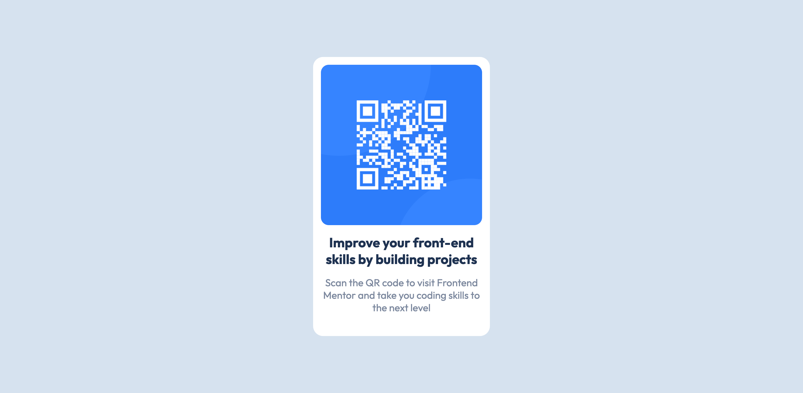

# Frontend Mentor - QR code component solution

This is a solution to the [QR code component challenge on Frontend Mentor](https://www.frontendmentor.io/challenges/qr-code-component-iux_sIO_H). Frontend Mentor challenges help you improve your coding skills by building realistic projects. 

## Table of contents

- [Overview](#overview)
  - [Screenshot](#screenshot)
  - [Links](#links)
- [My process](#my-process)
  - [Built with](#built-with)
  - [Continued development](#continued-development)
  - [Useful resources](#useful-resources)
- [Author](#author)
- [Acknowledgments](#acknowledgments)

**Note: Delete this note and update the table of contents based on what sections you keep.**

## Overview

### Screenshot

### Links

-  [Solution URL](https://www.frontendmentor.io/solutions/scss-css-html-q9zHkxl8e2)
-  [Live site URL](https://component-card-qr-code.vercel.app/)

## My process

I usually develop the design part with a design created in Figma, often using a grid. When developing in React, I frequently use Emotion or Styled Components. This kind of challenge is interesting as it brings me back to the basics plus without Figma, but with a little extra touch – SCSS. I feel more organized and scalable with SCSS, even though this component may not be scalable (but it's still good practice, isn't it?).

### Built with

- Semantic HTML5 markup
- SCSS preprocessor
- Mobile-first workflow

### Continued development

I love sharing my work with other people and contributing to what I already find interesting to comment on, so I will continue interacting with people in the frontendmentor community.

### Useful resources

- [SASS Docs](https://sass-lang.com/) - This is the official documentations of sass. I really liked this pattern and will use it going forward on very simple projects to pratice the basics.

## Author

- Website - [Cristian Melo](https://cursos.alura.com.br/vitrinedev/cristianmeelo)
- Frontend Mentor - [@cristianmeelo](https://www.frontendmentor.io/profile/cristianmeelo)

## Acknowledgments

It's not easy to make a perfect design without figma, with figma it's a little more difficult, but the more our frontend eyes are trained to see details, the more we will be successful when development is easier, in this case, when you have a team, or the design in hand, so congratulations to everyone who had the courage to face this challenge of responsiveness and handling images.

